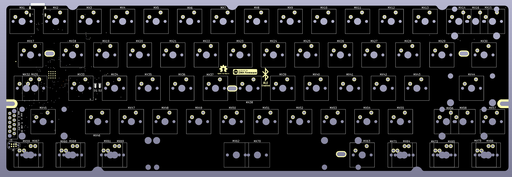
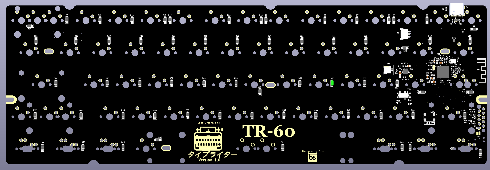

# TR-60
TR-60 is a 60% custom mechanical keyboard PCB that is inspired by the  [bakeneko](https://github.com/kkatano/bakeneko-60) PCB but adds couple of improvements over it.]

1. TR-60 adds BLE support to the PCB so that it can be used wirelessly.
2. Add tray mount compatibile holes to be use with keyboard cases like [Salvation](https://ilumkb.com/products/wilba-tech-salvation-keyboard)

TR-60 stands for typewriter-60.

The repository contains the kicad files of the keyboard PCB deisgn with nRF chip and this PCB is one of the first PCB to be built around nRF52840 bare chip and not around any module.

<strong>Front View</strong>.

<strong>Back View</strong>.x

<strong>Front View PCB assembled</strong>.

<strong>Back View PCB assembled</strong>.

The PCB is designed in such a way that is compatible with both nRF52840 and nRF52833 MCU as they have same pinouts and the NC pins on nRF53833 are being used in nRF52840 making it compatible with both MCU to mitigate supply shortage prioblems.

The PCB has a PC antenna for BLE and a onboard charger chip BQ24075 (also compatible with BA24073 and BQ24074) with a JST (1mm) connector for lipo battery. But the 1mm JST connector is non conventional and will be changed to a more mainstream connector with 2.5mm pitch with which most lipo batteries are shipped. A lipo battery of 200-1000mAh can be used with the PCB.(Note: Tested only with 300mAH battery, but upto 1000mAH shoulnd not be a problem. But do it on your own risk)

The PCB has a SWD 10 pin debug connector comaptible with [tag-connect](https://www.tag-connect.com/product/tc2050-idc-nl-050-all) 10 pin debug connector for flashing firmware.
The board also supports a Adafruit-UF2 bootloader to upload firmware through the USB-type-C connector (If PCB is bought from us). You can find how to build and flash UF2 boootloader to the baord in the tutorial. (still under creation)

The baord supports [ZMK](https://zmk.dev/) firmare for USB and BLE connectivity. The hardware definition for nRF52 chip is written and the guide to customize the keymap to customize the keys for the keyboard is still in progress. Please check back in few days to full guide to customize the keymaps, dowanload the firmware and flash it to the board. 

