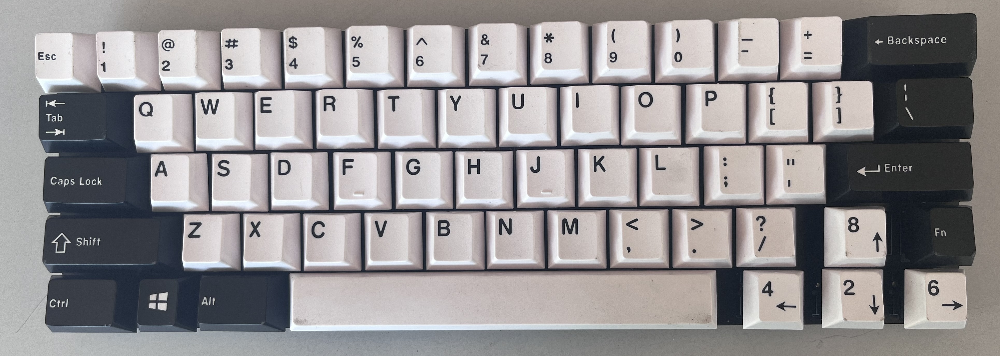
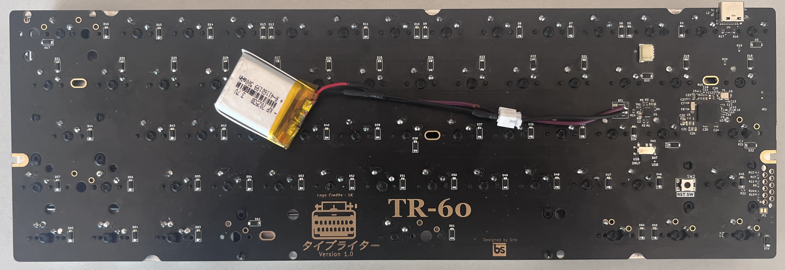
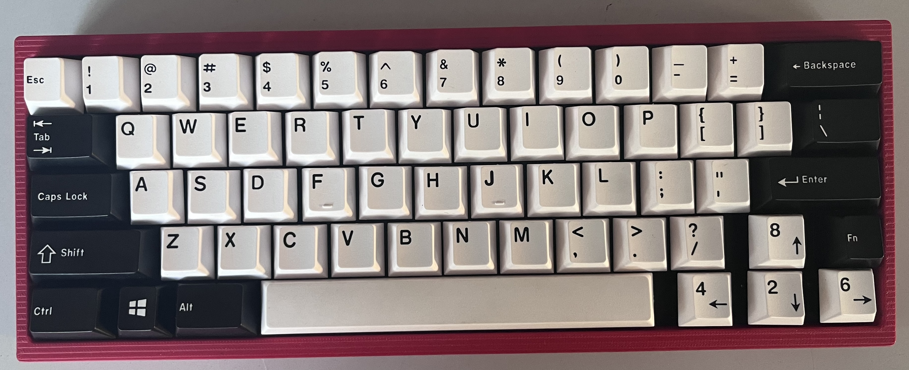

# TR-60
TR-60 is a 60% custom mechanical keyboard PCB that is inspired by the  [bakeneko](https://github.com/kkatano/bakeneko-60) PCB but adds a couple of improvements to it.

1. TR-60 adds BLE support to the PCB so that it can be used wirelessly.
2. Add tray mount compatible holes to be used with keyboard cases like [Salvation](https://ilumkb.com/products/wilba-tech-salvation-keyboard)

TR-60 stands for typewriter-60.

The repository contains the KICAD files of the keyboard PCB design with an nRF chip and this PCB is one of the first PCB to be built around the nRF52840 bare chip and not around any module.

<strong>Front View (Rendering)</strong>

<strong>Back View (Rendering)</strong>

<strong>Front View of PCB</strong>.

<strong>Back View of PCB</strong>.

<strong>Front View fully assembled with keycaps</strong>.

<strong>Back View fully assembled with battery</strong>.

<strong>Fully assembled with Bakeneko case</strong>.

The PCB is designed in such a way that is compatible with both nRF52840 and nRF52833 MCUs as they have the same pinouts and the NC pins on nRF53833 are being used in nRF52840 making it compatible with both MCUs to mitigate supply shortage problems.

The PCB has a board antenna for BLE and an onboard charger chip BQ24075 (also compatible with BQ24073 and BQ24074) with a JST (1mm) connector for lipo battery (But the 1mm JST connector is non-conventional and will be changed to a more mainstream connector with 2.54mm pitch with which most lipo batteries are shipped). A lipo battery of 200-1000mAh can be used with the PCB. (Note: Tested only with 300mAH battery, but up to 1000mAH should not be a problem. But do it at your own risk)

The PCB has a SWD 10-pin debug connector compatible with [tag-connect](https://www.tag-connect.com/product/tc2050-idc-nl-050-all) 10-pin debug connector for flashing firmware.
The board also supports an Adafruit-UF2 bootloader to upload firmware through the USB type-C connector (If a PCB is bought from us). You can find how to build and flash the UF2 bootloader to the board in an upcoming tutorial. (still under making)

You can also order your PCB from JLC PCB with the Gerber and BOM files provided in the repository in the production folder. The video guide on how to order from JLC will be up soon.

The board supports [ZMK](https://zmk.dev/) firmware for USB and BLE connectivity. The hardware definition for the nRF52 chip is written and the guide to customize the keymap to customize the keys for the keyboard can be found below. 

The firmware can be built directly on GitHub using GitHub actions and also a local toolchain can be set up on your computer to build firmware. Both the links can be found below.

1. [Local Toolchain setup](https://github.com/hw-tinkerers/zmk)
2. [Github Actions](https://github.com/hw-tinkerers/tr60-zmk-config)

# Note: Due to a hardware bug of not being able to automatically switch between USB and BLE output, there is a certain sequence that needs to be followed to pair and unpair device from host.
1. To pair Bluetooth very first time after flashing firmware, follow these steps,
    1. Clear Bluetooth profile by Fn+B
    2. Select Bluetooth output by pressing Fn + < key
    3. Then select the profile you want to add it to. Fn + N to add to profile 0 or Fn + M for profile 1.
    4. After doing all these steps go to the Bluetooth menu on the host and pair the device.
    5. Follow these steps exactly in the sequence, otherwise, there will be issue of continuous pairing and unpairing.
    6. To unpair the device follow the below steps.
    7. If it fails to pair, then first remove the device from the Bluetooth menu of host and then follow steps 1 through 4 again. 
1. To unpair the paired device or remove the device from the Host:
   1. First remove the device from the Bluetooth menu of the Host
   2. Clear the Bluetooth profile of the keyboard by pressing the Fn+B key and your profile host will be removed from the keyboard.
2. To pair a new device you have to first follow the first step to unpair and remove the device from the host if you have no Bluetooth profiles left. The keyboard supports 2 profiles. So if you have both of them occupied, then you need to follow the first step to unpair and then pair with this below mentioned sequence. If you have one more profile left then, just press Fn + M or Fn + N depending on what profile you want to add it to. For example, if you had added it in profile 0 that is Fn + N key then switch to profile 1 with Fn + M key and pair. Pairing with BLE is explained in 1st step. 
