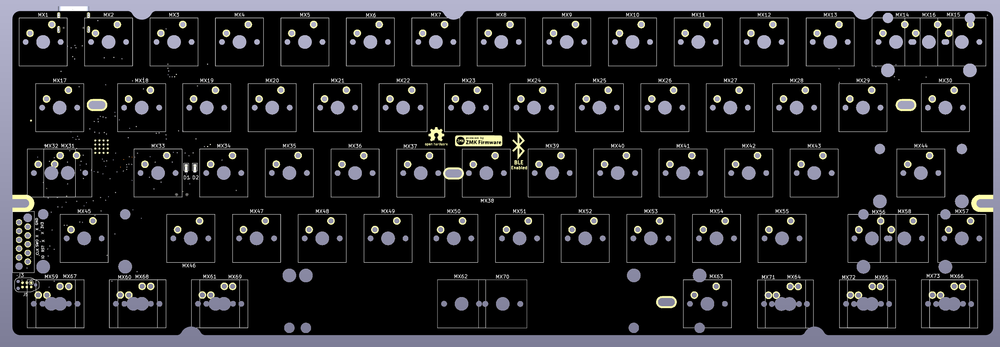
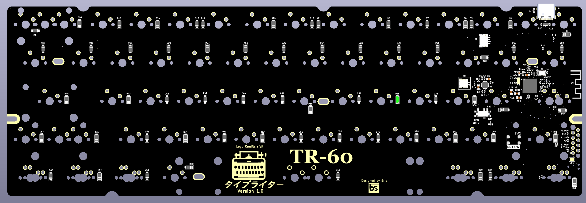

# TR-60
TR-60 is a 60% custom mechanical keyboard PCB that is inspired by the  [bakeneko](https://github.com/kkatano/bakeneko-60) PCB but adds a couple of improvements to it.

1. TR-60 adds BLE support to the PCB so that it can be used wirelessly.
2. Add tray mount compatible holes to be used with keyboard cases like [Salvation](https://ilumkb.com/products/wilba-tech-salvation-keyboard)

TR-60 stands for typewriter-60.

The repository contains the KICAD files of the keyboard PCB design with nRF chip and this PCB is one of the first PCBs to be built around nRF52840 bare chip and not around any module.

<strong>Front View</strong>.

<strong>Back View</strong>.

<strong>Front View PCB assembled</strong>.

<strong>Back View PCB assembled</strong>.

The PCB is designed in such a way that is compatible with both nRF52840 and nRF52833 MCU as they have the same pinouts and the NC pins on nRF53833 are being used in nRF52840 making it compatible with both MCU to mitigate supply shortage problems.

The keyboard has a PCB antenna for BLE and an onboard charger chip BQ24075 (also compatible with BQ24073 and BQ24074) with a JST (1mm) connector for lipo battery. But the 1mm JST connector is nonconventional and will be changed to a more mainstream connector with a 2.5mm pitch with which most lipo batteries are shipped. A lipo battery of 200-1000mAh can be used with the PCB. (Note: Tested only with 300mAH battery, but up to 1000mAH should not be a problem. But do it at your own risk)

The PCB has a SWD 10-pin debug connector compatible with [tag-connect](https://www.tag-connect.com/product/tc2050-idc-nl-050-all) 10-pin debug connector for flashing firmware.
The board also supports an Adafruit-UF2 bootloader to upload firmware through the USB-type-C connector (If a PCB is bought from us). You can find how to build and flash the UF2 bootloader to the board in the tutorial. (still under creation)

The board supports [ZMK](https://zmk.dev/) firmware for USB and BLE connectivity. The hardware definition for the nRF52 chip is written and the guide to customize the keymap to customize the keys for the keyboard can be found below.
1. [Github Actions Build](https://github.com/hw-tinkerers/tr60-zmk-config).
2. [Local toolchain setup](https://github.com/hw-tinkerers/zmk)
   
There are two options. You can build custom keymaps with GitHub Actions on your browser or you can setup a toolchain on your local machine and build locally on your computer.

A similar video is still in progress for ordering PCB and getting it assembled yourself. Please check back in some time. We appreciate your patience. 

